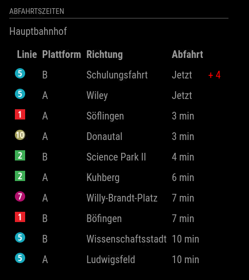

# MM2-PublicTransport-SWU

This a module for the [MagicMirror](https://github.com/MichMich/MagicMirror). It can display the departues of trains and busses of the SWU region in Ulm, Germany.

## Installation

In terminal, go to your MagicMirror's Module folder:
```
cd ~/MagicMirror/modules
```

Clone this repository:
```
git clone https://github.com/ChrwagnerTHU/MMM-PublicTransport-SWU
```

## Updating

In terminal, go to the Module's folder and pull the latest version from GitHub:
```
cd ~/MagicMirror/modules/MMM-PublicTransport-SWU
git pull
```

## Configuration options

### Main config
|Option|Default|Description|
|---|---|---|
|`stopNumber`|1008|ID of stop you want to display.|
|`stopString`|"Hauptbahnhof"|Name of stop you want to display.|
|`limit`|10|Number of departures you want to display.|
|`updateInterval`|60000|Update interval (in ms)|
|`showDelay`|`false`|Show delay of departure (in m)|
|`showPlattform`|[]|Array of plattform ids to be displayed.<br>Examples:<br>['A'] - only plattform A<br>['A','B'] - plattforms A and B<br>[] - all plattforms|

## Using the module

To use this module, add it to the modules array in the `~/MagicMirror/config/config.js` file.

### Example
```
    {
        module: "MMM-PublicTransport-SWU",
        header: "Abfahrtszeiten",
        position: "bottom_left",
        config: {
            stopNumber: 1008,
            stopString: "Hauptbahnhof",
            limit: 5,
            updateInterval: 60000,
        }
    },
```
To figure out the stop id of the stop you want to display, search the stop at [this](https://echtzeit.swu.de/haltestelle/abfahrtsmonitor#) website.
#### Screenshot


## Special Thanks
- [Michael Teeuw](https://github.com/MichMich) for creating the awesome [MagicMirror2](https://github.com/MichMich/MagicMirror/tree/develop) project that made this module possible.
